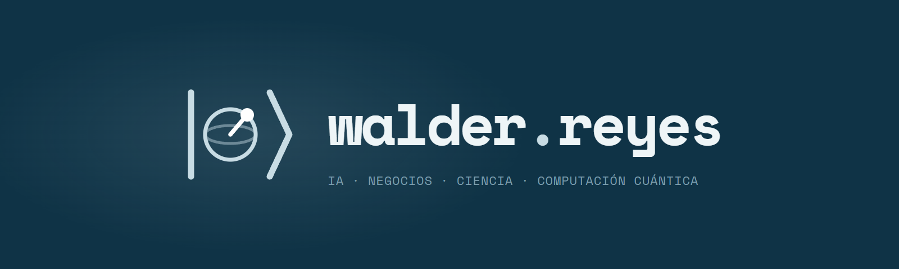

  <a href="https://walder001.github.io/"><strong>Ver portafolio ↗</strong></a>
  &nbsp; · &nbsp;
  <a href="https://walder001.github.io/laboratorio/">Explorar el laboratorio</a>
  &nbsp; · &nbsp;
  <a href="mailto:walderreyes34@gmail.com">Contacto</a>

# Walder Reyes · Portafolio

**Software Engineer · Product Builder · Entrepreneur**

Mi espacio para compartir cómo convierto problemas de negocio en software: ingeniería, automatización, inteligencia artificial y creación de productos en **DWALD**.

### Qué encontrarás

- **Trabajo seleccionado:** casos de automatización financiera, procesamiento de documentos con IA y arquitectura modular.
- **Productos DWALD:** una mirada a DWALD POS y DWALD Loan.
- **Laboratorio:** un cuaderno de experimentos interactivos construidos con Three.js, con lo que aprendí en cada uno.
- **Una experiencia adaptable:** español e inglés, modo claro y oscuro, y diseño para móvil y escritorio.

### Tecnología

HTML, CSS y JavaScript, con Three.js para las escenas 3D. Es un sitio estático, sin servidor de aplicación ni pasos de compilación. Se publica con GitHub Pages.

### Explorar el proyecto

| Archivo | Contenido |
| :--- | :--- |
| [`index.html`](index.html) | Página principal, estilos, traducciones e interacciones |
| [`laboratorio/`](laboratorio/) | Cuaderno de experimentos: «Colapso» y «Ecosistema» |
| [`assets/`](assets/) | Favicon, identidad visual e imagen para compartir |
| [`.nojekyll`](.nojekyll) | Publicación directa de los archivos estáticos |

<strong>Desarrollo y publicación</strong>

#### Ver en local

Abre `index.html` en tu navegador. Las fuentes y las bibliotecas 3D se cargan desde internet.

#### Editar el contenido

Los textos en español están en el HTML. Las traducciones al inglés están en el objeto `EN` dentro del `<script>` de `index.html`.

#### Publicar cambios

GitHub Pages usa la rama **`main`** y la carpeta **`/ (root)`**. Los cambios enviados a esa rama se publican automáticamente en **[walder001.github.io](https://walder001.github.io/)**.

---

**[Walder Reyes](https://github.com/walder001)** · [LinkedIn](https://www.linkedin.com/in/walder-reyes-de-jes%C3%BAs-514890182/) · [Escríbeme](mailto:walderreyes34@gmail.com)
